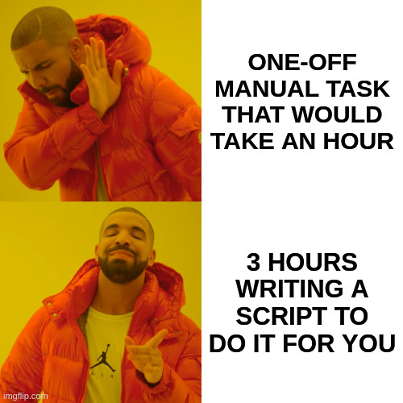

# A Case for Open Standards

Open standards is a big issue in the software world. 
I am not an expert on the topic but that doesn't make sensing
benefits of it less apparent for me and I am going to share my recent development experience that is tied with two differing standards to rest my case for *genuine* open standards.

## Open Standards 101

If no web-browser ever created fit your needs very-well you could be able
to create your very own web-browser given enough time, tenacity and 
manpower (or programmer-power to be more precise). That is possible because
Web is an open standard. You could find all the latest specification for
HTML, CSS and JS online and implement these specifications into a web browser
of your own liking without hassles like patents, fees etc. 

As a result of open standard nature of  the Web, different web engines 
like Blink(used by Chrome, Opera and Brave), Gecko(used by Firefox), Safari
(used by Apple) compete for superiority. Although these engines could differ
in various aspects like performance metrics, degree of conformity to the latest Web specifications, underlying code quality, they all strive for best possible implementation of Web specifications. For a moment think about possible implications of Web that is not based on open standards.

One could see similar theme for many other technologies. For example C18
is the latest ISO standard for C programming language and there exists
different compilers like GCC, LLVM Clang that support this standard of the
language. Many file formats like PNG, CSV and ePub are open standard file
formats. You would't need a propriety software to view these formats.
if needed one could write their own code to view files in these formats.

On the flip side one could see closed formats that are controlled by propriety
software. Flash Player could fit the bill as a good example. It wasn't an open
standard technology. I couldn't remember any serious competitors to Adobe's
Flash Player from pre-HTML5 days of the Web and it should not sound so
surprising since Flash wasn't an open standard format. 
As a side note Flash's distancing from open standards that was highlighted at
[Steve Jobs 2010 open letter that explains why they won't support Flash Player
on their mobile devices](https://www.theguardian.com/technology/blog/2010/apr/29/steve-jobs-flash-ipad-letter-dead) is noteworthy.

## Problems with Docx

If you are not a regular Microsoft Office user you could probably relate.
Docx files are problematic. Sometimes Microsoft Office alternatives like
Libre Office, Google Docs couldn't open them. Other times they could open 
these documents but couldn't display them as same as in Microsoft Word.
From my own experiences they have a great potential to render one-page original documents in two pages!
As a result after a while I started showing symptoms of docx-phobia. I believe
many non-Microsoft Office computer users suffer from this format in one way or another. At first you could put the blame on developers of competitors of other offfice suites for aforementioned problems.
You could argue that they could be incompetent to implement open standard 
of OpenXML of docx. 

If you scratch the surface you may find out OpenXML is another open standard
but if you delve into details things become more blurry. I don't want to go
on to technical details of OpenXML format of docx. There is actually [a great 
article](https://brattahlid.wordpress.com/2012/05/08/is-docx-really-an-open-standard/) that discuss whether docx could be considered an open standard.
Spoiler alert: According to article we couldn't say it is a true open standard. It would be more apt to view docx format as semi-open or
pseudo-open standard. From articles I sifted throught about OpenXML's standardization process I sensed serious contention.

** Demonstration against OOXML in Oslo, Norway in 2008**

Although I didn't do a through research on causes docx rendering
problems on non-Microsoft Office products, I highly suspecy it is highly related
to docx's non-conformity to open standards.

## My Latest Encounter with Docx Documents

In this section I am going to tell about my latest encounter with docx documents.
I admit next few paragraphs could be a little boring to read but rest of the article is contingent upon some background information.

It is finally time to tell a little bit about myself. I am working as a teaching assistant in a computer engineering department.  

Students in our department needs to complete 60 work-days long practical-work 
at a company as an intern to be conferred with bachelors degree.

This summer because of the Covid-19 pandemic our department followed 
the suit and offered its students projects that can be done from their 
homes instead of on-site work to complete their internships. Demand for project-based internship was really high. We received over 300 project submissions after the deadline.

Over-demand posed some paperwork related problems for internship commission. 
Our university asked to fill a poorly prepared Word document from each 
student and submit this form besides their project files and project report. 
Students were expected to fill student ID, name, begin and end date of their project 
fields of this form. Committee members need to fill some other fields of this form and print and sign the form afterwards.

Unfortunately students didn't conform to a single standard when they 
filled relevent fields. Some students prefered to capitalize their surnames 
but not others. There was variability between font family, font size and 
text color choices to name a few. Added to that the form was a DOCX document 
:man_facepalming: that doesn't render properly in LibreOffice. To deal with
rendering problems I later asked students to send their forms in PDF besides
DOCX but that didn't help much because most of our students continued
to send forms only in docx format.

## Circumventing DOCX

There are some libraries that generate docx documents like 
[docx.js](https://docx.js.org/#/usage/paragraph) but I didn't want to spend hours to figure out how to use a new library just to automate form creation task. 

Content of  all the form documents I needed were essentialy same but few text fields. I wondered
if I could locate these varied parts of the forms by opening docx document with
a text editor and search for values like student ID and name written to the document to locate fields that vary across different documents. This attempt failed
as soon as I realized that text is not stored in an intelligible (clear text) way in DOCX documents. 
`
After failed attempt to locate varied fields in DOCX form document it stroke on
me to try to test same thing after converting DOCX document into open standard
odt document on LibreOffice and that was another failure. In a nutshell 
OpenDocument format (odt) is a file that is formed by zip
compression of several files. By the way in this respect odt and DOCX formats are very similar.  As I tried to read this odt document as text without prior decompression, I failed once again. I should note that I could have succeeded in this step if I were to uncompress odt file prior to reading. Shortly after my second failure I discovered odt has an easier to work sibling called fodt that keeps its data in good old intelligible XML format in uncompressed way. Bingo!

After this great revelation I opened en empty docx form in LibreOffice and 
 converted it to fodt format and then did some editing on it to match it's appearance with original form document in docx that is rendered on Microsoft Office as close as I can. Afterwards, I located text fields that 
needs to be filled by students to create a template document out of fodt file.
Finally I wrote a program that would be able to generate form documents automatically from a CSV file where I recorded all necessary information and more for auto-generating forms. Thanks to Libre Office's headless capabilities my program was able to create a single PDF document that comprises of all forms that are needed to be printed to to be signed by myself. 

I think fodt is a great format for making automation tasks of document creation easier. As far as I know there is no equivalent format for docx. I believe an equivalent format would expose Microsoft Office's implementation of OOXML specification and that kind of exposure probably won't fit into Microsoft's agenda well unless a paradigm shift happens regarding their OOXML format. 

## ##Embracing DOCX

Just before finalizing this article I found out that I could have located varied text fields in docx form with more hardship than performing same task on fodt form documents. I could then write a form automation program with a more arduous work. This is not all good news though. Since there is no equivalent headless mode in Microsoft Office, my automation program wouldn't able to generate PDFs from DOCx documents. To refrain rendering problems I would end up using a friend's computer to print out many DOCx documents one by one instead of printing all form documents at once with help of a PDF CLI program such as pdfunite.  

## Takeaways

If open standard OpenDocument Format and its xml based intelligible sibling fodt never 
existed, I probably wouldn't able to write a program without much effort that would 
automate form generation.

In the end I probably have spent more time writing form generation program than doing 
menial office work like uploading document to Google Drive to open them in Google Docs, 
make some styling for each of them like using same font family, capitalizing surnames and 
then downloading document to hard drive. Repeating this task around 100 times was scary
enough for me, so that I ended up spending more time for automating this task.

*Perils of automation* [from xkcd]([xkcd: The General Problem](https://xkcd.com/974/))

I think my choice had paid off in few different ways. First of all I had a hands-on lesson
about obvious benefits of open standards and shared my experience by writing this article. 
Along the way I got some insight about DOCX and Open Document formats learned about 
existence of headless capabilities of LibreOffice. If I need to deal with a similar menial
task in word processing I am now in a stronger position to tackle the hassle!  

## Project Repositories

You could check [my form automation project repository](https://github.com/gusanmaz/InternshipFormGenerator) to learn more about
project's inner workings from its documentation or to adapt it to your own
needs. 

There is one step I skipped in the article about my attempts to tackle this paperwork
problem. Before writing an automation program I created a website that would automatically generate
a downloadable PDF form for a particular student after that student's ID information is inputted.
This website subjectively created better looking forms with same content, however since I was not able
to get an approval to use these forms in lieu of university's docx forms. Thus this project was another
failed attempt. You could also check [codes for this site from it's repository](https://github.com/gusanmaz/WebInternshipForms).   

## Supplementary Reading

Along the way I sifted through some articles and forum posts regarding open standards, OOXML and Open Document formats. I compiled a list of pages below that was worthworthy to me during my exploration. If you are interested in finer details and more insight these pages might be helpful. 

-[What are open standards? | Opensource.com](https://opensource.com/resources/what-are-open-standards)

https://stephesblog.blogs.com/papers/stdsprimer.pdf

[Lost in Translation: Interoperability Issues for Open Standards by Rajiv C. Shah, Jay P. Kesan :: SSRN](https://papers.ssrn.com/sol3/papers.cfm?abstract_id=1201708)

[Standardization of Office Open XML - Wikipedia](https://en.wikipedia.org/wiki/Standardization_of_Office_Open_XML)

[IBM VP: Office OpenXML a dead end, Microsoft will back ODF | Ars Technica](https://arstechnica.com/information-technology/2008/08/ibm-vp-office-openxml-a-dead-end-microsoft-will-back-odf/)

[Microsoft&#039;s Great Besmirching | Linux Journal](https://www.linuxjournal.com/content/microsofts-great-besmirching)

[MS Office 2007 OOXML file format (docx, xslx, pptx, ppsx) (View topic) &bull; Apache OpenOffice Community Forum](https://forum.openoffice.org/en/forum/viewtopic.php?f=74&t=4542)

[Office 2007 beginning to Bite (View topic) &bull; Apache OpenOffice Community Forum](https://forum.openoffice.org/en/forum/viewtopic.php?f=52&t=258)

[Advantages of FODT format in LibreOffice | box.matto.nl](https://box.matto.nl/fodtformat.html)
